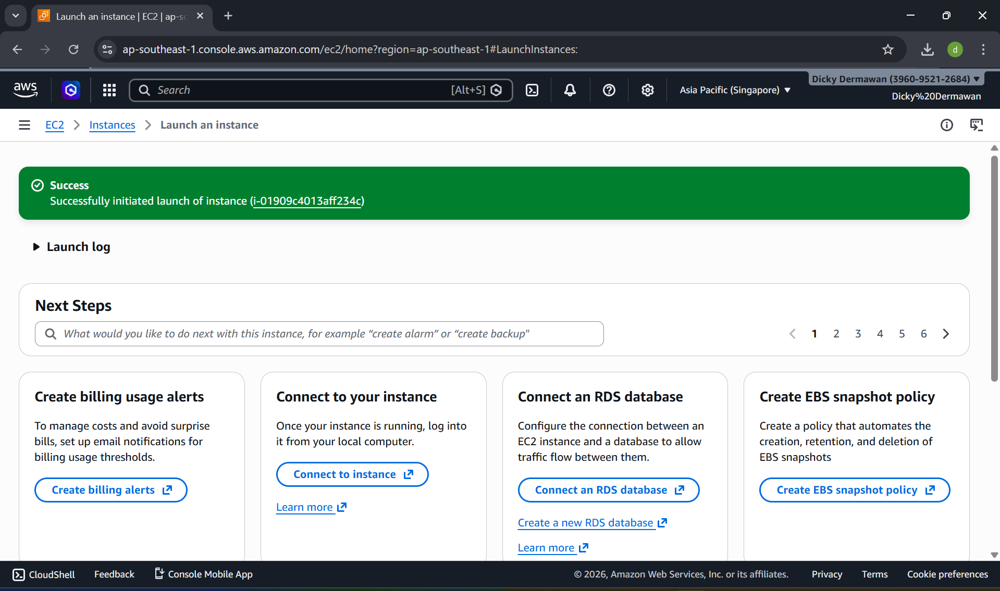
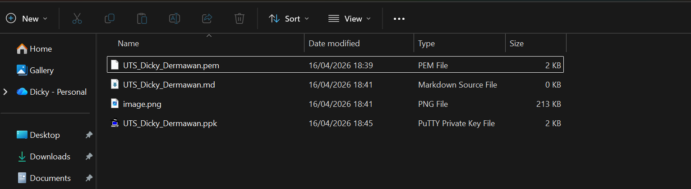
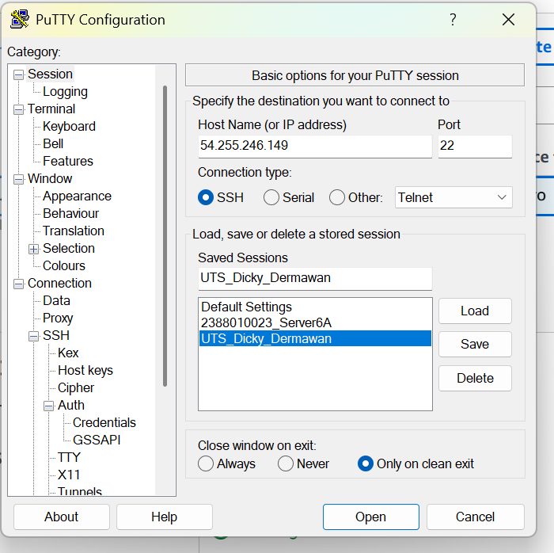
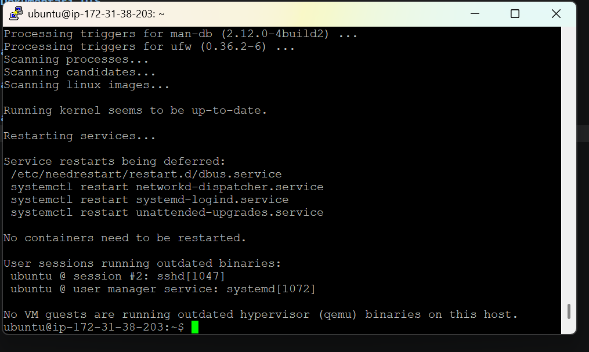
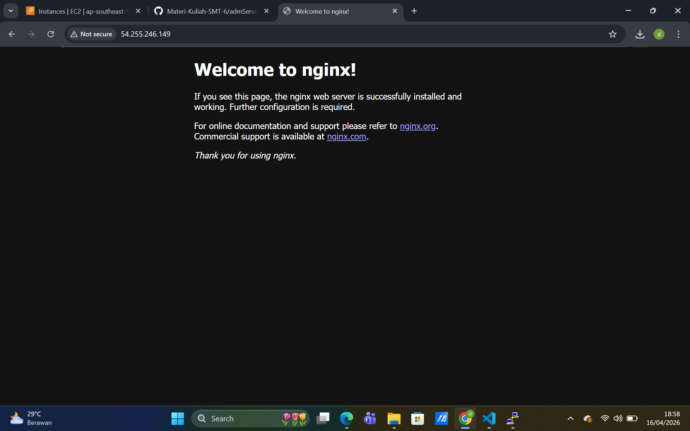
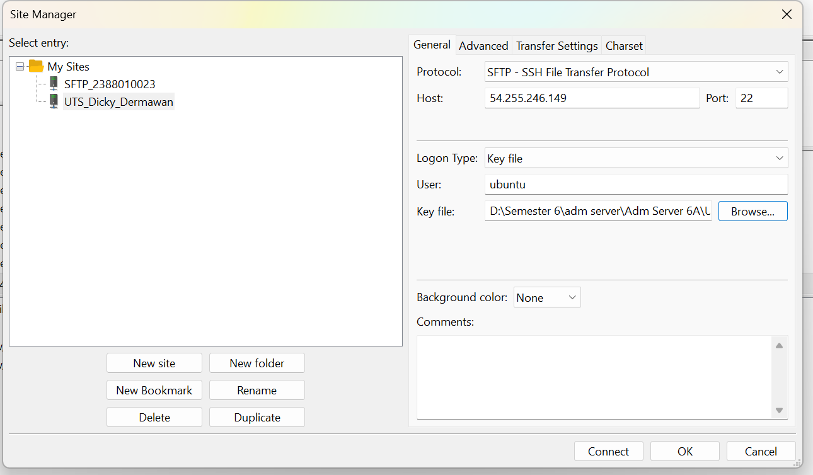
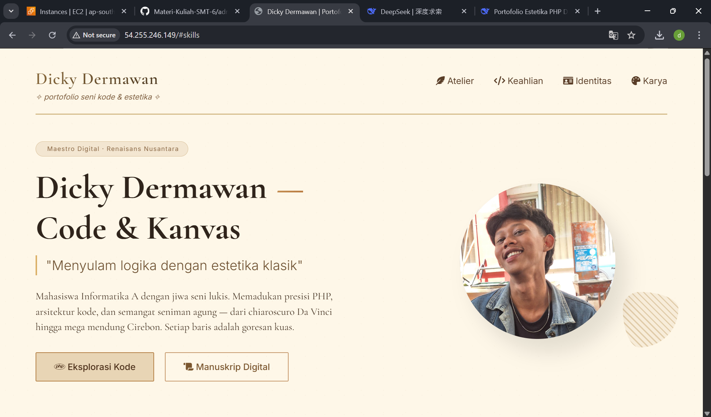
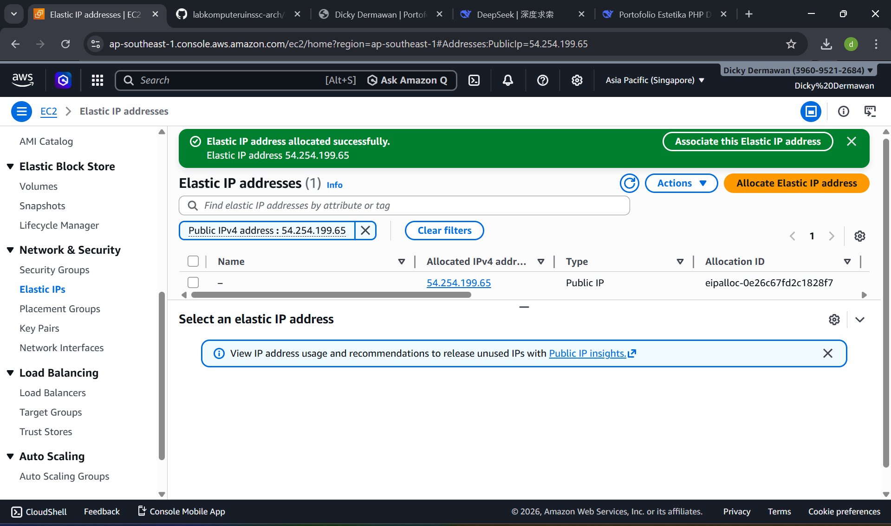
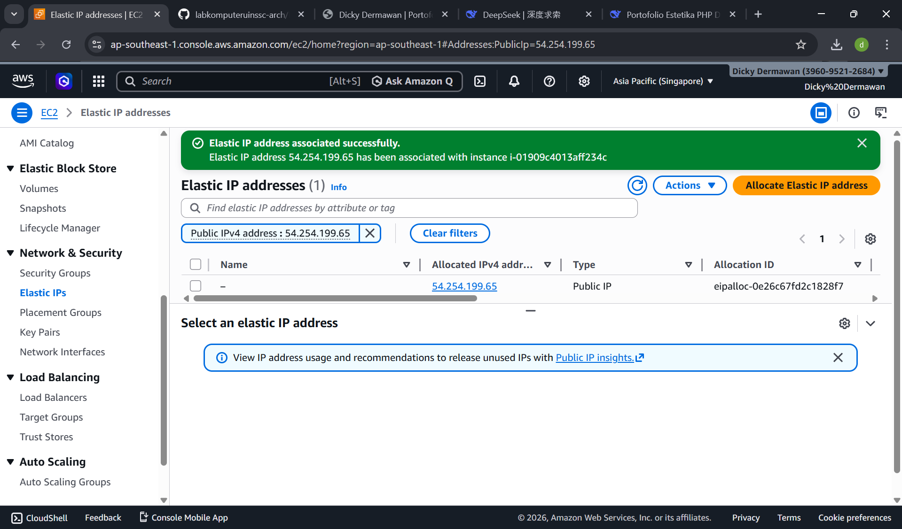
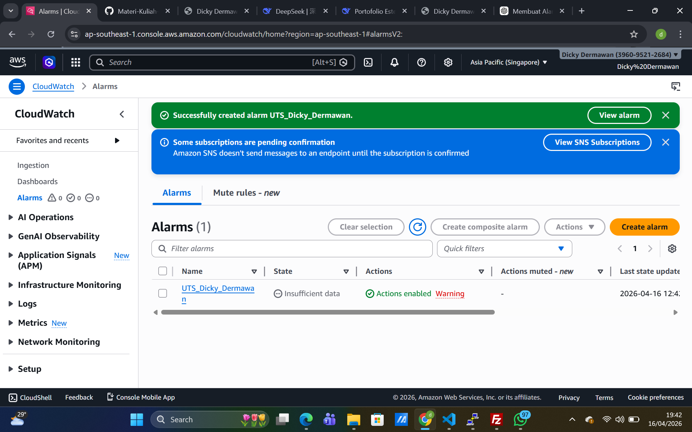

# Dokumentasi UTS

1. Membuat Instances baru

2. Membuat file .ppk menggunakan putyygen

3. configurasi putty / set up putty

4. update dan upgrade ubuntu terus kita instal nginx

5. set up filezilla

6. web portofolio berhasil dibuat

7. Membuat elastic IP

8. Membuat Alrm 
